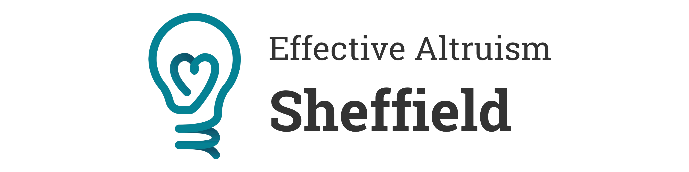

EA Sheffield is a local group for anyone interested in how to do the most good. Our events are open to anyone, including students and professionals.

# Come to our pub socials every other month!

We currently have socials on the last Tuesday of even months (February, April, June, ...). We usually meet at The Old Shoe (Orchard Square) at 7pm.

You can check the [calendar](calendar) for any exceptions. Sometimes we meet outside if the weather is nice and there probably won't be a social in December because of Christmas.

# Stay up to date

You can find all of our events in the [calendar](calendar) and the [EA Forum](https://forum.effectivealtruism.org/groups/YjhuGBkHCQbZsTdzW){:target="\_blank"}.

You can also [subscribe to our newsletter](https://tinyurl.com/ea-sheffield-newsletter){:target="\_blank"}.

Once you've come to an event, you can join our WhatsApp group for more updates and discussions!

# Help shape EA Sheffield

EA Sheffield is still relatively small and new. Help make it useful and fun by filling out [this survey](https://tinyurl.com/ea-sheffield-survey){:target="\_blank"}. It only has 6 quick questions. You can also always give [anonymous feedback](https://tinyurl.com/ea-sheffield-feedback){:target="\_blank"}.
